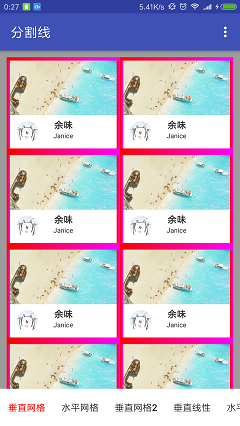
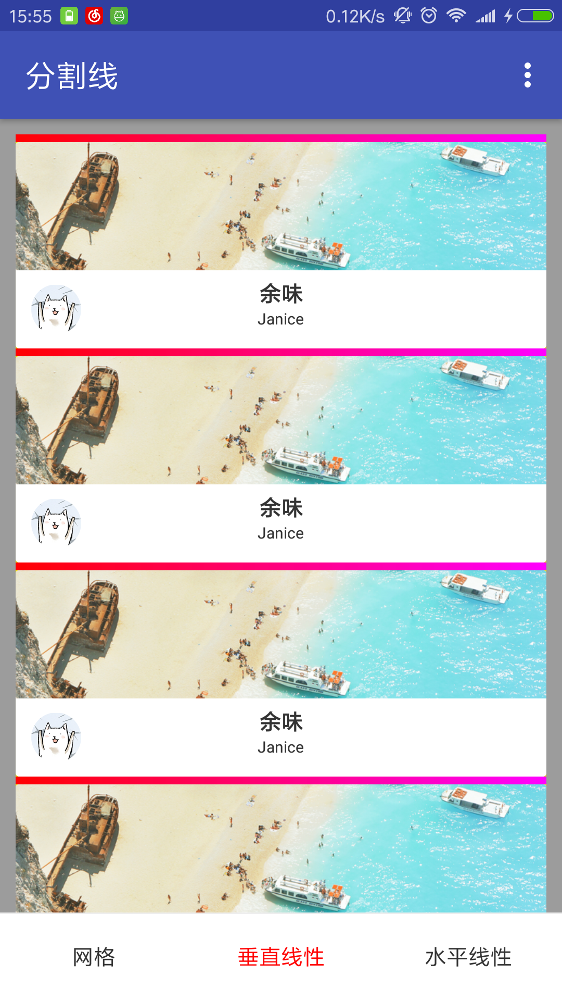
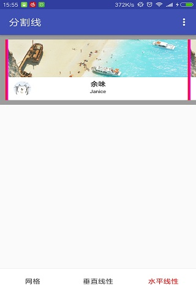
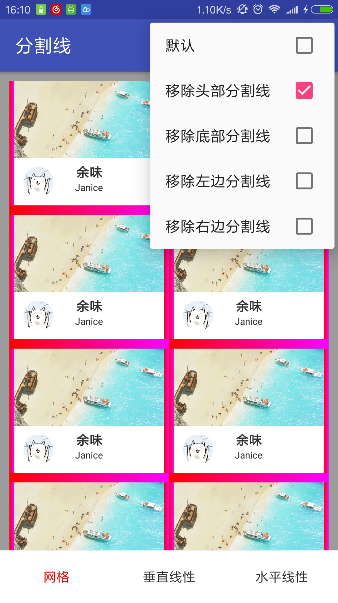
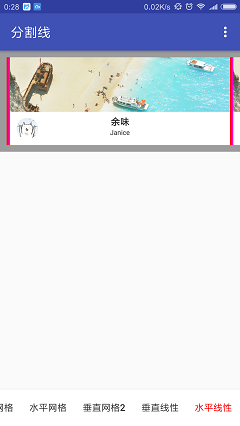
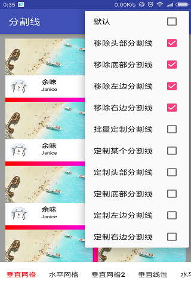
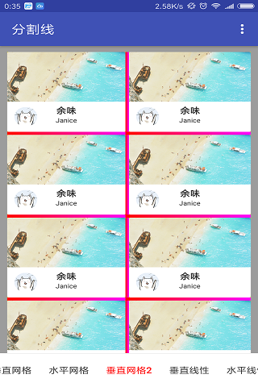

# FlexItemDecoration
灵活的分割线，可绘制头部、底部、最左边、最右边分割线，还可以定制某一行的分割线和批量定制多行分割线。

## 效果图
| 垂直网格                          | 水平网格                          | 垂直网格2                         |
| -------------------------------- | -------------------------------- | -------------------------------- |
|  |  |  |

| 垂直线性                          | 水平线性                          | 定制分割线-线性布局				 |
| -------------------------------- | -------------------------------- | -------------------------------- |
|  |  |  | 

| 定制分割线-网格布局				   | 移除分割线-线性布局				  | 移除分割线-网格布局				 |
| -------------------------------- | -------------------------------- | -------------------------------- |
|  |  |  |

## Demo
[下载 APK](apk/app-debug.apk)

## 依赖
#### 添加依赖：
```
	dependencies {
		implementation 'ckrjfrog.FlexItemDecoration:Decoration:1.0.2'//gradle plugin 3.0(包含)以上使用
		//compile 'ckrjfrog.FlexItemDecoration:Decoration:1.0.2'//gradle plugin 3.0一下使用
	}
```

## 功能及使用
#### 1.网格分割线的使用
```
		DividerGridItemDecoration.Builder builder = new DividerGridItemDecoration.Builder(context,orientation,SPAN_COUNT);//SPAN_COUNT:列数,orientation:水平或竖直方向
		builder.setDivider(R.drawable.bg_divider_list)//设置分割线的颜色及宽高
		       .setShowOtherStyle(false)//另一种方式显示网格分割线
		       .removeHeaderDivider(false)//是否移除头部分割线
                       .removeFooterDivider(false)//是否移除底部分割线
                       .removeLeftDivider(false)//是否移除最左边分割线
                       .removeRightDivider(false)//是否移除最右边分割线
		       .subDivider(1, 4)//分割线截取绘制，1：开始下标，4：结束下标
                       .setSubDividerHeight(24)//设置截取分割线的高度，在竖直方向有效
                       .setSubDividerWidth(24)//设置截取分割线的宽度，在水平方向有效
                       .setSubDividerDrawable(R.drawable.bg_divider_offset_grid)//设置截取分割线的样式
		       .redrawDivider(2)//分割线定制的下标
                       .redrawDividerHeight(30)//定制分割线的高度，在竖直方向有效
		       .redrawDividerWidth(30)//定制分割线的宽度，在水平方向有效
                       .redrawDividerDrawable(R.drawable.bg_divider_redraw_grid)//定制分割线的样式
		       .redrawHeaderDivider()//头部分割线的定制，在竖直方向有效
                       .redrawHeaderDividerHeight(40)//定制头部分割线的高度
                       .redrawHeaderDividerDrawable(R.drawable.bg_divider_offset_grid);//定制头部分割线的样式
		       .redrawFooterDivider()//底部分割线的定制，在竖直方向有效
                       .redrawFooterDividerHeight(40)//定制底部分割线的高度
                       .redrawFooterDividerDrawable(R.drawable.bg_divider_offset_grid)//定制底部分割线的样式
		       .redrawLeftDivider()//最左边分割线的定制，在水平方向有效
                       .redrawLeftDividerWidth(40)//定制最左边分割线的宽度
                       .redrawLeftDividerDrawable(R.drawable.bg_divider_list)//定制最左边分割线的样式
		       .redrawRightDivider()//最右边分割线的定制，在水平方向有效
                       .redrawRightDividerWidth(40)//定制最右边分割线的宽度
                       .redrawRightDividerDrawable(R.drawable.bg_divider_list);//定制最右边分割线的样式
		recyclerView.addItemDecoration(builder.build());
```

#### 2.线性分割线的使用
```
		DividerLinearItemDecoration.Builder builder = new DividerLinearItemDecoration.Builder(context, orientation);//orientation:方向
		builder.setDivider(R.drawable.bg_divider_list)//设置分割线的颜色及宽高
                       .removeHeaderDivider(false)//是否移除头部分割线，在竖直方向有效
                       .removeFooterDivider(false)//是否移除底部分割线，在竖直方向有效
                       .removeLeftDivider(false)//是否移除最左边分割线，在水平方向有效
                       .removeRightDivider(false)//是否移除最右边分割线，在水平方向有效
		       .subDivider(1, 4);//分割线截取绘制，1：开始下标，4：结束下标
		       .setSubDividerHeight(24)//设置截取分割线的高度，在竖直方向有效
                       .setSubDividerWidth(24)//设置截取分割线的宽度，在水平方向有效
                       .setSubDividerDrawable(R.drawable.bg_divider_offset)//设置截取分割线的样式
		       .redrawDivider(2)//分割线定制的下标
                       .redrawDividerHeight(30)//定制分割线的高度，在竖直方向有效
		       .redrawDividerWidth(30)//定制分割线的宽度，在水平方向有效
                       .redrawDividerDrawable(R.drawable.bg_divider_redraw)//定制分割线的样式
		       .redrawHeaderDivider()//头部分割线的定制，在竖直方向有效
                       .redrawHeaderDividerHeight(40)//定制头部分割线的高度
                       .redrawHeaderDividerDrawable(R.drawable.bg_divider_offset);//定制头部分割线的样式
		       .redrawFooterDivider()//底部分割线的定制，在竖直方向有效
                       .redrawFooterDividerHeight(40)//定制底部分割线的高度
                       .redrawFooterDividerDrawable(R.drawable.bg_divider_offset)//定制底部分割线的样式
		       .redrawLeftDivider()//最左边分割线的定制，在水平方向有效
                       .redrawLeftDividerWidth(40)//定制最左边分割线的宽度
                       .redrawLeftDividerDrawable(R.drawable.bg_divider_list)//定制最左边分割线的样式
		       .redrawRightDivider()//最右边分割线的定制，在水平方向有效
                       .redrawRightDividerWidth(40)//定制最右边分割线的宽度
                       .redrawRightDividerDrawable(R.drawable.bg_divider_list);//定制最右边分割线的样式
		recyclerView.addItemDecoration(builder.build());
```

License
-------

    Copyright 2018 ckrgithub

    Licensed under the Apache License, Version 2.0 (the "License");
    you may not use this file except in compliance with the License.
    You may obtain a copy of the License at

       http://www.apache.org/licenses/LICENSE-2.0

    Unless required by applicable law or agreed to in writing, software
    distributed under the License is distributed on an "AS IS" BASIS,
    WITHOUT WARRANTIES OR CONDITIONS OF ANY KIND, either express or implied.
    See the License for the specific language governing permissions and
    limitations under the License.
